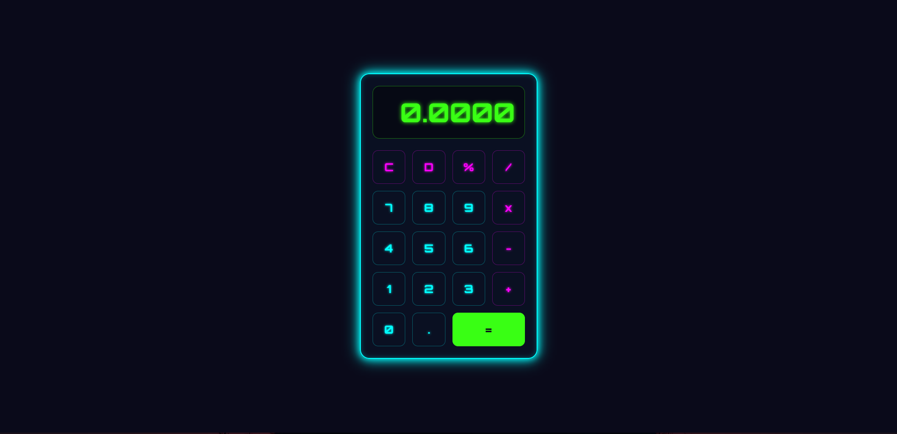

# 🔢 Neon Glow Calculator

A stylish digital calculator built with **HTML**, **CSS**, and **JavaScript**, featuring a glowing neon interface and smooth user experience.

## ✨ Features

- Basic arithmetic operations: `+`, `−`, `×`, `÷`
- Percentage and clear (`C`) functions
- Real-time display updates
- Neon-themed UI with color-coded buttons
- Responsive layout for desktop and mobile

## 🧰 Technologies Used

- **HTML5** – Structure of the calculator
- **CSS3** – Neon glow effects, layout, and styling
- **JavaScript** – Calculator logic and interactivity

## 🚀 How to Run

1. Clone or download the repository.
2. Open `index.html` in your browser.
3. Start calculating with style!

## 📁 File Structure
neon-calculator/ 
 ├── index.html       # Main HTML file  
 ├── style.css        # Styling with neon effects  
 ├── script.js        # Calculator logic  
 └── README.md        # Project documentation 

## 📸 Screenshot

> 

## 💡 Future Enhancements

- Add keyboard support
- Include scientific functions (√, ^, etc.)
- Toggle between light and dark themes
- Add sound effects for button clicks

## 🙌 Author

Made with 💚 by **Prahalad**

## 📄 License

This project is licensed under the [MIT License](LICENSE).